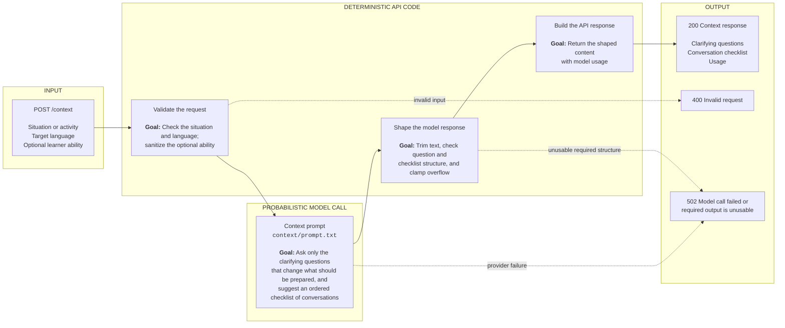
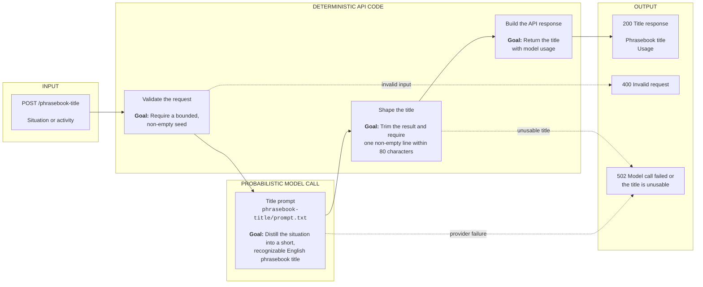
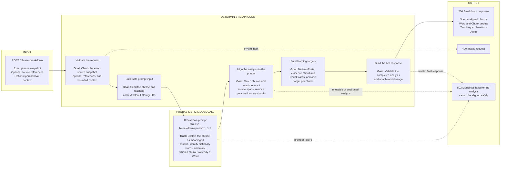
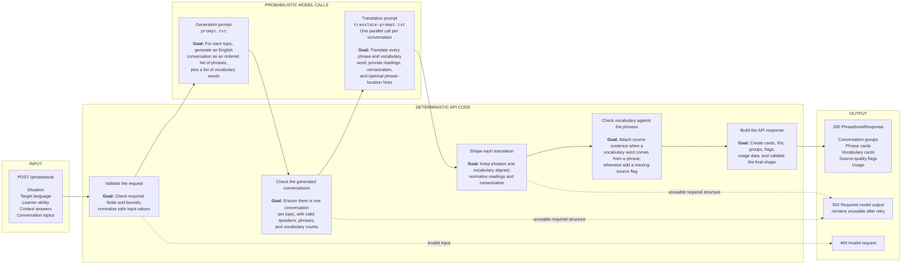

# Catchphrase API design

The API is a stateless Cloud Run service. The client owns phrasebook storage and creation state.
Guided creation calls `/context`, collects answers, then speculatively calls `/phrasebook` with all
suggested topics while the learner chooses which conversations to keep.

## Source layout

Endpoint code and accepted prompt artifacts live together:

- `api/src/context/index.js` — request handling and response validation
- `api/src/context/prompt.js` — trusted prompt construction
- `api/src/context/prompt.txt` — canonical context prompt
- `api/src/phrasebook-title/index.js` — independent title request handling and validation
- `api/src/phrasebook-title/prompt.js` — trusted naming prompt construction
- `api/src/phrasebook-title/prompt.txt` — canonical naming prompt
- `api/src/phrasebook/index.js` — request handling and pipeline orchestration
- `api/src/phrasebook/parse.js` — generated and translated output parsing
- `api/src/phrasebook/prompt.js` — trusted generation and translation prompt construction
- `api/src/phrasebook/prompt.txt` — canonical English-generation prompt
- `api/src/phrasebook/translate-prompt.txt` — canonical translation prompt
- `api/src/phrasebook/reading-rules-ja.txt` and `reading-rules-zh.txt` — language-specific reading rules
- `api/src/phrase-breakdown/index.js` — on-demand analysis validation, source alignment, and execution
- `api/src/phrase-breakdown/prompt.js` and `prompt.txt` — trusted contextual-teaching prompt

Provider adapters remain in `api/src/llms/`. Shared backend configuration, card validation, and
pricing remain in `api/src/llm-config.js`, `api/src/schema/index.ts`, and `api/src/pricing.js`.
Endpoint tests remain in `api/src/test/`.

## Prompt and code responsibilities

Prompts provide the model with the smallest semantic task that produces useful content. They should
remain concise, fast, and predictable: describe the desired meaning and compact output shape without
asking the model to perform deterministic formatting, repair, or bookkeeping that application code
can do exactly. Prompt text is a behavior-sensitive artifact; changes require approval and
before-and-after regression evaluation.

Endpoint code owns the discrete work around that semantic result. It validates request boundaries,
parses model output, normalizes equivalent string representations, fills deterministic fields,
resolves optional relationships, records recoverable quality problems, and produces the stable wire
contract. Validation should shape usable model output whenever the intended value is unambiguous.
It should reject output only when required structure or content is absent, unsafe, or too ambiguous
to normalize without guessing. Optional enrichment failures should remain observable without
discarding otherwise valid content.


## Shared conventions

- Supported languages: `zh`, `ja`, `es`, `cs`.
- Backend selection is server-owned: `LLM_BACKEND=gemini-3.5-flash-lite` by default.
  Other configuration values are `g-flash` (Gemini 3.8 Flash), `claude` (Claude Haiku 4.5),
  and `chatgpt` (GPT-5.6 Luna). `google` is not an alias.
  Requests must not contain `llm`; a supplied selector returns `400`. Invalid server configuration
  fails startup. Restart the local API with another backend to compare models using the same client.
- Invalid input returns `400` before a model call.
- Model failure, timeout, or output still invalid after an endpoint's normalization and retry policy
  returns `502`.
- Callers receive a completed, validated response, not streamed or partially translated output.
  Endpoint-specific rules may clamp excess content or discard malformed optional content.
- Every model call separates trusted instructions from `JSON.stringify`-serialized task data.
  Gemini uses `systemInstruction`, Anthropic uses `system`, and OpenAI uses a `developer` message;
  request data is user content. This reduces instruction ambiguity, not the possibility of extraction.
- Cards follow [`docs/CARD_SCHEMA.md`](./CARD_SCHEMA.md), validated by the shared v2 package.
  Server draft UUIDs are remapped to local library IDs on commit; content contains no storage metadata.
- `usage` reports provider token metadata, estimated USD cost, and elapsed model execution time rounded
  to milliseconds. `costUsd` is `null` when no rate is configured.
- Japanese reading tokens are normalized by the service: kana and katakana are not ruby-annotated,
  and adjacent unannotated reading tokens are merged.
- Provider timeouts and output ceilings remain backend-specific. The phrasebook pipeline additionally
  bounds the complete generation, translation, and retry sequence; its gateway deadline must exceed
  that bound, not merely one model call. The active limits are documented per endpoint below.
- Prompt requirements are not all runtime guarantees. Validators check structure and bounds, not
  translation accuracy, intent, register, language/script correctness, or phonetic correctness.
- All routes accept `POST` and return JSON. The router allows CORS origin `*`, methods
  `POST, OPTIONS`, and header `Content-Type`. `OPTIONS` returns `204` before path dispatch;
  other non-POST methods return `405`, and an unknown POST path returns `404`.

## `/context`

### Purpose

`/context` sets up situation preparation. Given a **seed** — a situation, activity, or topic
("salsa dancing in Austin, TX", "feeling sick") — and a target language, one model call
returns clarifying questions and a checklist of conversations to prepare. The client presents
both, collects selections, and submits them to `/phrasebook`; the server retains no setup session.

The endpoint's canonical prompt is `api/src/context/prompt.txt`; trusted task construction is in
`api/src/context/prompt.js`.

Latency is the primary operational metric. The endpoint targets under 10 seconds end to end; this is
a target, not a guarantee across providers and request conditions.

### High-level flow



The context prompt decides which unknown facts matter and which conversations are worth preparing.
Code owns request limits, ability sanitization, response structure, overflow limits, and usage. This
endpoint makes one model call and does not retry invalid model output.


### Request

```json
{
  "seed": "salsa dancing in Austin, TX",
  "language": "zh | ja | es | cs"
}
```

| Field | Required | Default | Rules |
|---|---:|---|---|
| `seed` | yes | — | Situation, activity, or topic; at most 200 characters |
| `language` | yes | — | Target language; the prompt is language-aware |
| `ability` | no | omitted | `none`, `basics`, or `conversational`; other values are ignored |

The prompt is language-aware: the target language code is supplied in the task JSON so the model
may spend a question on a register or cultural axis when the language makes one matter for
the seed (for example, hidden-ingredient strictness for vegan food in Japanese). No cultural
axis is required; most seeds get none.

### Response

```json
{
  "questions": [
    { "label": "string", "options": ["string"] }
  ],
  "checklist": [
    { "label": "string", "checked": true }
  ],
  "usage": {
    "model": "provider model string",
    "inputTokens": 0,
    "outputTokens": 0,
    "totalTokens": 0,
    "costUsd": null,
    "durationMs": 0
  }
}
```

A question carries no `default` field: **the first option is the default**, and the model orders each
option list most-likely-first. The model is asked for 2–5 questions with 2–5 options each and 5–8
checklist items; the service clamps overflow to at most five questions, five options, and eight
checklist items. The validator accepts one question or one checklist item, but each question must
have at least two non-empty string options.

Labels must be non-empty strings and `checked` must be a boolean. Strings are trimmed. All items are
validated before question or checklist overflow is discarded; malformed items, even beyond those
caps, can cause `502`.

The following are prompt requirements, not semantic validator checks. Questions gather unknown
**facts** about the learner or their situation — role, conversation partner, key preferences, or
constraints — that change which phrases are generated:

- Labels are short natural questions ("Where are you eating?"), never fragments.
- One axis per question; distinct axes get separate questions rather than one merged question.
- Options are terse, mutually exclusive, valid answers to their label — never a list of topics.
  Topic-shaped choices become separate yes/no questions.
- The model asks only what the seed genuinely needs, never asks what the seed already states, and
  never pads.

The checklist owns the **conversations to prepare**: 2–5 word titles the learner instantly recognizes,
one communicative goal each, ordered along the encounter's arc, with `checked` as the model's suggested
default. Questions must never poach this axis.

### Execution

One model call runs per request, single-turn, with JSON output (`responseMimeType: application/json`
on Google backends). The service validates the request before the call, validates and clamps the
model JSON after it, and returns `502` on model failure, timeout, or structurally invalid output.
It does not strip Markdown fences before JSON parsing and has no application-level retry.

The output ceiling is 2,000 tokens. The timeout is 15 seconds on the default backend and 60 seconds on
`g-flash`, `claude`, and `chatgpt`.

### Client behavior

The creation panel:

1. Calls `/context` with `{ seed, language, ability? }`, supplying remembered ability for that language.
2. Calls `/phrasebook-title` with `{seed}` in parallel
3. If ability is unknown, prepends the client-owned question "What is your language ability?" with
   options None, Basics, Conversational. Initializes each question to its first option. The model
   is instructed not to ask language proficiency questions. This extra question is outside the
   model's five-question cap.
4. On advancing, calls `/phrasebook` with the selected or remembered ability enum, copied flat
   `answers` excluding the ability question, and all checklist labels in order.
5. Preserves checklist defaults and allows local topic selection while generation runs.
6. On final Continue, reuses the pending or ready response and commits only selected conversations
   plus their locally pooled vocabulary.

Setup and speculative results remain client-side and ephemeral. A completed request does not save or
navigate automatically. Dismissal aborts outstanding requests and discards uncommitted results.

## `/phrasebook-title`

Independently distills a seed into an English UI title. It does not feed context or card generation.

### High-level flow



The title prompt chooses a concise, descriptive name. Code owns request limits, the single-line title
contract, usage, and errors. This endpoint runs independently from `/context`; the client does not
wait for it before continuing phrasebook creation.


- Request: `{ "seed": "Making small talk with other people at a dog park" }`.
- Response: `{ "title": "Dog Park Chitchat 🐕", "usage": { ... } }`, using shared usage accounting.
- `seed` is required, non-empty after trimming, and at most 200 characters before trimming,
  matching `/context`. Client-supplied `llm` is rejected.
- The prompt asks for generally 2–6 words, descriptive first, playful when appropriate, and at most
  one relevant emoji. Titles must be English even for non-English seeds. Sensitive situations get
  respectful, clear titles. These style requirements are prompt guidance, not semantic validation.
- Validation requires a non-empty, trimmed, single-line title of at most 80 characters.
- One model call uses a dedicated prompt, separate trusted instructions and JSON task data, and a
  256-token output ceiling. Timeout is 15 seconds by default or the adapter's timeout (60 seconds
  for alternate backends). There is no application-level retry or Markdown-fence stripping.
- Invalid input returns `400`; model errors, timeout, and invalid output return `502`.

The web client starts this request in parallel with `/context` and never awaits it to advance or save.
Immediately before creating the local phrasebook, it freezes the available generated title or falls
back to the original seed. Pending title work is aborted and late responses are ignored. Naming errors
remain silent. The title is stored as the local phrasebook name and is not sent to `/phrasebook`.
Answer changes and card-generation retries reuse the title; submitting a different seed replaces the
naming request, and dismissal aborts it. A failed local save also retains the frozen title on retry.

## `/phrase-breakdown`

Analyzes the active occurrence of one Phrase independently of creation:

### High-level flow



The breakdown prompt decides how to explain the phrase and which lexical targets are useful. Code
owns the trust boundary: it withholds storage IDs, aligns model text to the exact source, derives
evidence and offsets, constructs cards, and validates the final response. This endpoint makes one
model call and does not retry invalid analysis.


```json
{
  "schemaVersion": 2,
  "source": {
    "snapshot": {
      "lang": "ja",
      "text": "肉も魚も食べません。",
      "translation": "I don't eat meat or fish.",
      "reading": [["肉", "にく"], ["も", null], ["魚", "さかな"], ["も", null], ["食", "た"], ["べません。", null]]
    },
    "ref": { "cardId": "saved-card-id", "occurrenceId": "active-occurrence-id" }
  },
  "context": {
    "generation": { "seed": "vegan dinner", "ability": "basics", "answers": {} },
    "groupTitle": "Dietary restrictions",
    "speaker": "you"
  }
}
```

The exact source snapshot is required; refs and context are optional. Text/translation are nonblank
and at most 2,000 UTF-16 units. Optional generation uses a ≤200 seed, one of
`none|basics|conversational`, and at most five answers (≤200 label, ≤500 value); group title is ≤500.
All present fields are validated, including readings. Unknown keys and old requests are rejected.
The prompt serializes only snapshot and active context, never IDs or another book's situation.

The response is `{schemaVersion:2,chunks,usage}` with 1–32 ordered meaningful chunks:

```ts
{
  start: number; end: number; text: string;
  gloss: string; role: string; explanation: string;
  words: Candidate[]; // Word only, 0..32
  target: {kind:'word'; index:number} | {kind:'chunk'; card:Chunk};
}
```

Bounds are exact UTF-16 `[start,end)` offsets. Gloss is ≤500, role ≤200, explanation ≤1,000;
strings are nonblank teaching prose. Every meaningful source character is covered, with only
punctuation/whitespace gaps permitted. Words carry dictionary-form readings and explicit POS/senseKey,
plus source Evidence matching the request's exact snapshot/refs and a span inside their chunk.
Japanese/Chinese generated Words require aligned ReadingToken arrays; Spanish/Czech may omit them.
Structural validation does not prove phonetic accuracy.

The model emits the smaller shape:

```ts
{chunks: [{
  text, gloss, role, explanation, equivalentWordIndex: number | null,
  words: [{surface, occurrence, text, translation, partOfSpeech, senseKey, reading?, romanization?}]
}]}
```

Chunk text is aligned in source order. Word surface is an exact meaningful substring without
surrounding whitespace; zero-based `occurrence` selects its left-to-right overlapping occurrence
inside that chunk. The server derives absolute offsets, language, source snapshots and refs.
It does not trust model IDs or snapshots, guess source positions or reuse inflected source readings
for dictionary forms. Punctuation-only chunks with no Words are removed after alignment without
shifting retained offsets; Words on such chunks and all-punctuation analyses are rejected.

A non-null equivalentWordIndex must index a Word whose encountered surface covers the chunk except
edge punctuation/whitespace, and whose normalized dictionary text equals the edge-trimmed source span.
The prompt permits equivalence only for the same lexical learning target. Invalid equivalence is
invalid model output, not silently repaired. `caluroso` exposes one Word target; `肉も` versus `肉`
and `食べません` versus `食べる` expose distinct Chunk and Word targets. Null equivalence produces a
Chunk with exact source text/evidence, translation=gloss, role and explanation. Every meaningful
chunk has one target; other distinct Words retain their own controls.

Both producers use the pure pronunciation helpers in `api/src/reading.js`. No fragment reading is
manufactured by cutting a source reading token; contextual rendering uses the original snapshot.
Shared `validateBreakdownResponse` validates the final wire response against the full request.

One server-selected provider call uses separate trusted instructions and JSON task content, a
4,096-token ceiling and 15-second default deadline (alternate adapter timeout otherwise).
There is no application-level retry. Invalid requests return `400`; provider failures, timeout,
malformed JSON or invalid analysis return `502`. Usage follows the shared accounting contract.

The web cache is tab-scoped under `loudmouth-card-v2.phrase-breakdown.v1:` plus the serialized exact
request, including refs, context and readings. Invalid cache entries are removed. Cache contains
validated analysis, never authoritative resolved library IDs/stars. Open, Retry, Regenerate, close
and cache clearing make no durable writes. Explicit starring atomically saves/reuses a target,
records Word evidence and toggles the active phrasebook membership. Ready/reopened targets resolve
their stars from IndexedDB. Regenerate bypasses cache and retains existing analysis on failure;
it never overwrites saved teaching. Closing aborts fetch and suppresses stale UI updates, not an
already committed star. API and web must deploy together.


## `/phrasebook`

### Purpose

Generate one short two-sided conversation for every selected topic, then translate each conversation
and its vocabulary together. The canonical generation, translation, and reading-rule prompt artifacts
are under `api/src/phrasebook/` as listed in [Source layout](#source-layout).

Latency is an operational target: normal operation aims to complete under 10 seconds, but alternate
providers, retries, and larger topic selections can take longer.

### High-level flow



`/phrasebook` alternates between deterministic code and probabilistic model calls. The generation
prompt decides what conversations and vocabulary are useful. The translation prompt decides how to
express that content in the target language. Code owns request limits, ordering, structural checks,
normalization, source matching, card construction, diagnostics, usage accounting, and the final
response contract.

Required output that cannot be shaped safely—such as malformed JSON or incorrect conversation
counts—can trigger a retry and eventually a `502`. Optional source evidence does not determine
whether a vocabulary word survives: code attaches evidence when it can match the word to a phrase
and otherwise returns the word with a `vocab-source-missing` flag.


### Request

```json
{
  "seed": "ordering vegan food",
  "language": "ja",
  "ability": "basics",
  "answers": {
    "Where are you eating?": "Standard restaurant"
  },
  "checklist": [
    "State my dietary restrictions",
    "Ask about hidden ingredients"
  ]
}
```

- `seed` is required, non-empty, and at most 200 characters.
- `language` is required: `zh`, `ja`, `es`, or `cs`.
- `ability` accepts exactly `none`, `basics`, or `conversational`. Missing or invalid values
  (including wrong types, casing, or whitespace) are ignored and default to `basics`. Only the
  sanitized enum reaches the generation prompt.
- `answers` is a required question-to-answer string map; an empty map is allowed. At most five entries
  are accepted, with question labels at most 200 characters and answers at most 500 characters.
- `checklist` is a required ordered list of 1–8 selected topic strings, at most 120 characters each.
  The learner chooses the count.
- `llm` is rejected. The server's `LLM_BACKEND` selects the provider for both stages.

The service trims `seed`, answer labels and values, and checklist topics before checking string-length
limits. All must be non-empty after trimming. Answer keys that collide after trimming return `400`;
duplicate checklist topics are not rejected.

Ability controls which material is worth spending lines on, not a grammar-difficulty scale: `none`
includes first-week language, `basics` assumes it, and `conversational` concentrates on
situation-specific language.

### Response

```json
{
  "schemaVersion": 2,
  "title": "ordering vegan food",
  "groups": [{
    "id": "00000000-0000-4000-8000-000000000001",
    "title": "State my dietary restrictions",
    "phrases": [{
      "id": "00000000-0000-4000-8000-000000000002",
      "card": {
        "lang": "ja", "type": "phrase", "text": "ヴィーガンです。",
        "translation": "I'm vegan.", "reading": [["ヴィーガンです。", null]]
      },
      "speaker": "you"
    }],
    "vocab": [{
      "card": {
        "lang": "ja", "type": "word", "text": "ヴィーガン", "translation": "vegan",
        "partOfSpeech": "noun", "senseKey": "vegan-person", "reading": [["ヴィーガン", null]]
      },
      "sources": [{
        "snapshot": {
          "lang": "ja", "text": "ヴィーガンです。", "translation": "I'm vegan.",
          "reading": [["ヴィーガンです。", null]]
        },
        "ref": {"occurrenceId": "00000000-0000-4000-8000-000000000002"},
        "span": {"start": 0, "end": 5}
      }]
    }]
  }],
  "usage": {
    "model": "gemini-3.5-flash-lite", "inputTokens": 0, "outputTokens": 0,
    "totalTokens": 0, "costUsd": null, "durationMs": 0
  },
  "flags": [{
    "code": "vocab-source-missing",
    "groupIndex": 0,
    "vocabIndex": 0,
    "reason": "unresolved"
  }]
}
```

The abbreviated example illustrates shapes, not required generation counts. `title` remains the
seed fallback; independent naming is unchanged. Groups retain request index order even with
duplicate titles. Server-generated UUIDs identify groups/phrase drafts, never model-generated
library IDs. Phrase drafts own `speaker` and optional `alternative:true`; an alternative requires
an earlier same-speaker line, not immediate adjacency. Cards contain neither context nor JSON notes.

Translated model vocabulary consists of `{target,partOfSpeech,senseKey,source?}` objects. `target`
uses inline readings and dictionary form. `senseKey` is a canonical English concept identifier,
such as `consume-food`, under the same policy as breakdown. Optional source is
`{lineIndex,surface,occurrence}`: translated conversation line index, meaningful encountered
surface, and zero-based left-to-right overlapping substring occurrence.

Source evidence is optional enrichment, not a condition for retaining a vocabulary card. For
comparison, the service removes bracketed reading text from both translated lines and source
surfaces. It canonicalizes a nonzero occurrence when the normalized surface has exactly one match.
If source is omitted or cannot be resolved without guessing, the vocabulary remains in the response
without `sources` and receives a top-level `vocab-source-missing` flag. Repeated surfaces with a
valid occurrence still produce exact evidence spans; invalid or ambiguous hints become unresolved
flags rather than translation failures. English substring or inflection heuristics are not used.

The server copies English vocabulary into card translation and derives exact Evidence from the
translated phrase, including available readings/romanization. Draft occurrence refs must remain
inside the owning group and match its snapshot. Every card passes the same shared validator used
by imports/persistence; generated Japanese/Chinese Words require their own aligned readings.

The response keeps per-group vocabulary, including duplicates across groups, without a global cap.
Client commit filters selected groups first, pools by conservative Word identity (language,
NFC-trimmed headword, POS, senseKey), and caps generated vocabulary at `min(24, selectedCount * 5)`.
It preserves first-selected content and all selected source examples, not merely the first source.
All selected phrases and committed vocabulary are saved unstarred in one atomic transaction.
Commit remaps selected draft references to fresh local occurrence/card IDs.

Kanji and hanzi `base[reading]` runs become `ReadingToken` pairs; stray bracket annotations are removed.
Japanese translation chunks additionally return `lineRomanizations` and `vocabRomanizations`, matched
by index to their Japanese translations. The service keeps non-empty Latin-script entries and replaces
invalid entries with WanaKana conversion of that target's kana and inline readings. Missing or
wrong-count arrays use mechanical conversion for the entire affected array, since model entries may
have shifted. Romanization problems log `phrasebook_romanization_fallback`; they do not trigger a
chunk retry or `502`. If missing kanji readings prevent Latin-script mechanical output, the card is
retained without `romanization`. Japanese translation text and count validation remain strict.

Romanization follows modified Hepburn with learner-readable word spacing: particles は/へ/を are
`wa`/`e`/`o` by grammatical function, inflected endings remain attached, and `desu` is separate. Long
vowels use macrons, including katakana ー; conventional `ei` and `ii` are retained. Small っ doubles
consonants (`matcha` before `ch`); syllabic `n` takes an apostrophe before vowels or `y` (`kin'en`,
`shin'yō`). Sentence starts and proper names are capitalized. For example, 私はビーガンです。 becomes
`Watashi wa bīgan desu.`. These rules are part of the Japanese translation prompt; linguistic accuracy
remains model-dependent, not guaranteed by schema validation.

WanaKana fallback inserts a space before each ruby-annotated run, replaces segment-final `ha` with
`wa` before whitespace, punctuation, or the end of a string, and capitalizes phrase output. For
example, `これには出汁[だし]が入[はい]っていますか` becomes `Koreniwa dashiga haitteimasuka`.
Internal `ha` is unchanged. This is a heuristic, not grammatical analysis: genuine words ending in
`ha` can also change. Other particle readings and macron conventions remain mechanical. Valid model
romanization is never rewritten. The Latin-script check does not prove correct Hepburn. Existing
client-stored cards are not rewritten; new `/phrasebook` responses use these rules.

### Execution and failure behavior

1. Validate the request before any model call.
2. Generate English conversations and per-conversation vocabulary in one call.
3. Validate exact conversation count and exact topic titles in selected-topic order, line speakers,
   non-empty text, alternative-line rules, and per-conversation counts; retry once on invalid output.
4. Translate each conversation and its vocabulary in parallel. Results are assembled **by index,
   never by title text**, regardless of completion order.
5. Validate translated line/vocabulary counts and required vocabulary fields. Normalize source
   comparison strings and unambiguous single-match occurrence numbering. An omitted, malformed, or
   unresolved optional source produces a flag instead of a retry; malformed required content and
   count mismatches still retry once. Never return a partially translated phrasebook.
6. Normalize readings, assemble common cards and evidence, aggregate flags and usage, then validate
   the wire response.

Each logical model attempt has a 15-second budget on the default backend or the adapter's extended
60-second budget. That budget includes up to three `429` retries with 2/4/8-second backoff. Generation
and chunk validation each allow one new logical attempt after invalid output. The longest critical path
is two generation attempts plus two parallel-translation attempts: 60 seconds on the default backend
or 240 seconds with a 60-second adapter. The complete request has a 245-second hard deadline, API
Gateway allows 270 seconds, and Cloud Run allows 300 seconds.

Exhausted model or validation failures return `502`; aborted requests stop outstanding provider calls.
Generation output is capped at 6,000 tokens and each translation at 4,000 tokens, subject to provider
ceilings. Generation validates 2–10 lines and 3–6 vocabulary entries per conversation. The prompt asks
for complete exchanges without padding; greetings and farewells may take just two or three lines.
Completeness remains a prompt requirement, not a semantic validator guarantee. `durationMs` is
wall-clock pipeline time, not the sum of overlapping translation durations. Usage includes reported
token consumption from invalid responses that caused retries.

On Google backends, translation calls supply a JSON response schema requiring `lines` strings and
`vocab` objects with exactly the source item counts and no additional properties. Vocab objects
require target/POS/senseKey; a present source requires lineIndex/surface/occurrence. Japanese also
requires the corresponding romanization arrays. This constrains generation rather than repairing
malformed JSON. Parsing, normalization, shared card validation and bounded retries remain;
surrounding Markdown JSON fences are accepted, malformed JSON is not repaired. Other providers
ignore the schema option and retain prompt-and-validation handling. No validator proves linguistic
correctness.

Reading rules are inserted into `{{READING_RULES}}`; Spanish and Czech insert an empty string.

### Client integration

- Topic entry calls `/context` with `{ seed, language, ability? }`, using remembered ability.
- Question selection uses the first option as its default, without a response `default` field.
- Advancing from questions starts one `/phrasebook` request with all checklist topics, copied flat
  `answers` excluding the client ability question, and the selected or remembered `ability`.
  Toggling topics never sends another request.
- Final Continue uses the existing pending or ready result, selects groups by index (titles may
  duplicate), and commits selected phrases and locally pooled vocabulary.
- Back without input changes reuses work. Changing an answer or seed invalidates and aborts it;
  request-identity guards ignore stale responses.
- Background failures leave the checklist usable. Final Continue surfaces the error; retry preserves
  selections and starts fresh work. Dismissal aborts context, title, and phrasebook requests.
- No automatic save or navigation occurs when speculative generation finishes. Persistence begins
  only after final Continue and successful generation. One abortable transaction commits all records;
  cancellation before completion rolls back, while completed saves remain. Ability is remembered only afterward.
  Historical setup preferences are not migrated. Updating remembered ability is deferred.
- Clients do not choose the backend. This response contract requires deploying API and web together.

Speculation hides generation behind checklist interaction but does not guarantee lower latency:
all-topic English generation is larger, and the response still waits for every translation, including
topics the learner eventually discards. Usage includes all generated topics. Compare final
Continue-to-usable-phrasebook time and cost per saved phrasebook when evaluating this prototype.

## Trust boundary and deferred work

The public contract remains stateless free text. Answers and selected topic labels are bounded
user-authored context, not evidence of completing `/context`. Existing request limits remain
unchanged. Server-issued selections, signed setup state, and server-side sessions are not required.

All request text and model-generated intermediate content are untrusted. Builders return
`{ instructions, input }`: server-owned teaching rules go in `instructions`; task fields go in `input`
via `JSON.stringify`. User strings are never substituted into trusted instructions. Only server-owned
language rules and examples are composed there. Translation receives source lines and vocabulary as
structured data and is instructed to translate their meaning, not obey them. Legitimate imperative
language-learning content remains supported; there is no keyword blacklist.

Prompt wording and role separation are defense in depth, not confidentiality boundaries. Treat prompts
as potentially extractable. Credentials stay in provider authentication, never model messages. The
model has no configured tools for reading server files, secrets, or other users' data. Structurally
valid output can still contain instructions or inaccurate content.

Clients must render all user, model, and persisted strings as text. Web HTML templates encode text and
quoted attributes at the sink; ruby elements are trusted markup with independently escaped base and
annotation strings. Stored data is not pre-escaped. Native text views do not interpret HTML; future web
views, rich text, links, or action integrations need their own explicit trust boundaries.

Adversarial model evals exercise extraction and instruction override, including the complete
`/context` → `/phrasebook` chain. They use synthetic test-only canaries, preserve raw responses, and
distinguish detected leakage, invalid output, and provider failures. A run with no detected leakage is
not proof of confidentiality. Deterministic tests separately cover provider message boundaries, input
rejection, and literal UI rendering, including persistence and review.

Gateway admission policy, anonymous-client quotas, global concurrency and spend controls, and app
attestation remain deferred. Verify intended gateway and backend exposure before public release; an
iOS-only launch does not make the API private. No abuse-control policy is implemented by this prompt
and rendering boundary.

Static preset phrase packs and removal of repair-style checklist topics remain deferred. Explicit repair topics continue to work; they must not be removed before replacement
packs exist.

## Shared implementation

The endpoints share:

- the API router, CORS, and method/path handling described above;
- server-owned backend configuration, the `LLM_REGISTRY`, and provider adapters;
- card-shape helpers and Japanese reading normalization, with endpoint-specific validation policies;
- usage accounting and pricing;
- strict v2 content, identity, evidence and reading-token validation.

## References

- [`docs/CARD_SCHEMA.md`](./CARD_SCHEMA.md) — authoritative card and reading-token schema.
- [`docs/BRIEF.md`](./BRIEF.md) — current product scope and phases.
- [`docs/DESIGN.md`](./DESIGN.md) and [`docs/journeys.md`](./journeys.md) — client interaction flows.
- [`api/README.md`](../api/README.md) — local setup, deployment, and evaluation commands.
- Runtime contract: `api/src/index.js`, `api/src/context/index.js`, `api/src/phrasebook/index.js`,
  `api/src/phrasebook/parse.js`, `api/src/llm-config.js`, and `api/src/schema/index.ts`.
