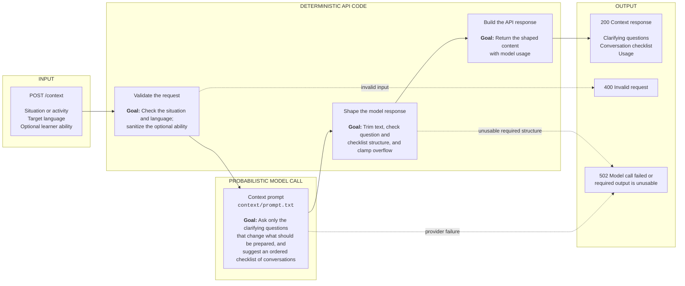
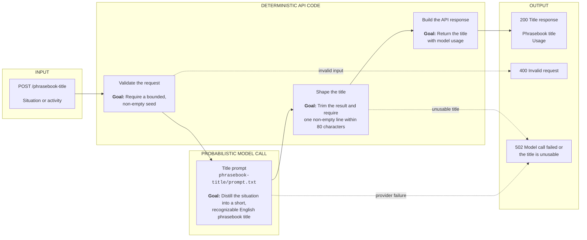
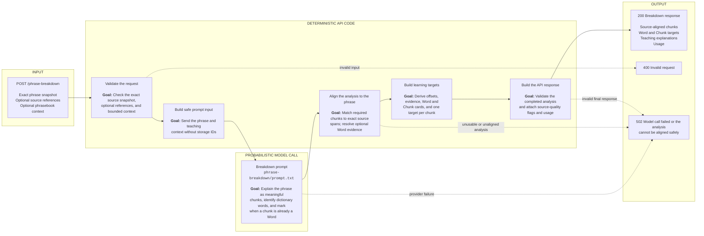
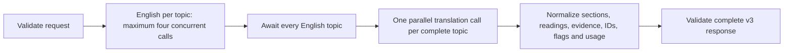

# Catchphrase API design

The API is a stateless Cloud Run service. The client owns phrasebook storage and creation state.
Guided creation calls `/context`, collects answers, then speculatively calls `/phrasebook` with all
suggested topics while the learner chooses which conversations to keep.

**2026-10-01 cutover:** this document describes checked-in v3 production code, not a deployment.
The user promoted per-topic DeepSeek English generation and dialogue-first Gemini translation despite
known translation defects. Translation improvement is separate work: the retained 19-topic review
has 8 passes and 11 material failures, including Japanese romanization polarity misalignment.
That evidence remains failed; there is no linguistic acceptance seal. Earlier experiment sections
below are historical measurements, not the current wire contract.

### Cutover verification and prompt impact

Evidence is retained under `.prompt-romp/product-cutover-2026-10-01/`, particularly
`prompt-regression-report.json`, `live-smoke-runs.json`, `live-provider-calls.jsonl`,
`eight-topic-router-smoke.json`, and `browser-proof.json`. Failed observations remain in those records.
Commit cleanup removes redundant CLI exports and superseded browser/debug captures, not original
observations. Canonical experiment runs, evaluations, reviews, prompts, approvals, accounting ledgers,
direct-review inputs/findings and historical decisions remain retained, including failed results.

The three English baselines used the old whole-book Gemini prompt; the selected after-path uses
four concurrent DeepSeek topic calls. These are combined prompt/model/architecture/workload changes,
not an isolated wording A/B or statistical latency benchmark:

| Scenario | Before English ms; input/output tokens | After English phase ms; aggregate input/output tokens |
|---|---|---|
| Restaurant | 2708; 1439/622 | 3139; 4294/1275 |
| Salsa | 1253; truncated JSON, provider reported 0/0 | 16315; 4242/1266 |
| Pharmacy | 2142; 1440/598 | 7213; 4306/1564 |

All three new English chapters passed structural validation. Context before/after used the same
Gemini backend/settings; all six responses passed their corresponding validators:

| Scenario | Context ms before → after | Input/output tokens before → after |
|---|---|---|
| Restaurant | 2216 → 2565 | 1014/223 → 1510/393 |
| Salsa | 1520 → 2349 | 1018/278 → 1514/501 |
| Pharmacy | 1465 → 2239 | 1014/268 → 1510/531 |

The extra context tokens produce seed-specific bowl, dance-object, and pharmacy still-life prompts.
Question quality is not certified: the salsa result still includes an interaction-shaped question.
The retained 19-topic translation order trial increased output tokens from 19,265 to 19,691
and reported cost from $0.0618878 to $0.0629528, without resolving its material translation failures.

Five actual native API requests returned HTTP 200: Japanese restaurant 13,146ms, Spanish salsa
19,993ms, Chinese pharmacy 14,374ms, Czech restaurant 12,235ms, Ukrainian restaurant 11,204ms.
Their 28 provider calls required no application retry. The separate offline eight-topic request
preserved duplicate-title identity and input order despite out-of-order completion, with peak
English concurrency four and no translation before all English completed.

Final checks: API 128 tests passed; web 234 tests across 18 files passed; strict typecheck and
production build passed; gateway YAML parsed. Actual browser checks covered contents/topic layouts
at 320/390/768/1280px, all five scripts, enlarged romanized text and reduced motion, keyboard/focus,
shared stars and Review, phrase details, supplemental Chunks, section-local reorder/reload,
v3 backup round-trip/old-backup rejection, and untouched legacy databases/preferences.
The credential-free guided replay took 1520ms from checklist display and 1221ms from final Continue;
its bilingual HTTP response took 26ms and the existing minimum loading interval is 1000ms.
Those replay timings are not live model or deployed Cloud Run latency.

Decoded fixture PNGs proved image contract validation, nonfatal timeout, persisted ready art,
and late hero-only updates preserving page, cards, focus, scroll and edit state. Pending art became
failed on reload with zero provider requests. These synthetic layout images do **not** establish
watercolor or matting quality. The three live cover checks remain blocked by missing private
`FAL_KEY` and authenticated bounded fal pricing. No deployment or secret provisioning was performed.
Lifetime conservative accounting is $2.3876218931 against the $5 cap; unknown-charge reservations
remain included. Full per-call reported/estimated cost distinctions are in the regression report.

## Source layout

Endpoint code and accepted prompt artifacts live together:

- `api/src/context/index.js` — request handling and response validation
- `api/src/context/prompt.js` — trusted prompt construction
- `api/src/context/prompt.txt` — canonical context prompt
- `api/src/phrasebook-title/index.js` — independent title request handling and validation
- `api/src/phrasebook-title/prompt.js` — trusted naming prompt construction
- `api/src/phrasebook-title/prompt.txt` — canonical naming prompt
- `api/src/phrasebook/index.js` — request handling and pipeline orchestration
- `api/src/phrasebook/parse.js` — generated and translated output parsing
- `api/src/phrasebook/prompt.js` — trusted generation and translation prompt construction
- `api/src/phrasebook/prompt.txt` — canonical English-generation prompt
- `api/src/phrasebook/translate-prompt.txt` — canonical translation prompt
- `api/src/phrasebook/reading-rules-ja.txt` and `reading-rules-zh.txt` — language-specific reading rules
- `api/src/phrase-breakdown/index.js` — on-demand analysis validation, source alignment, and execution
- `api/src/phrasebook-image/index.js` — independent image generation, matting, and decoded PNG validation
- `api/src/phrase-breakdown/prompt.js` and `prompt.txt` — trusted contextual-teaching prompt

Provider adapters remain in `api/src/llms/`. Shared backend configuration, card validation, and
pricing remain in `api/src/llm-config.js`, `api/src/schema/index.ts`, and `api/src/pricing.js`.
Endpoint tests remain in `api/src/test/`.

## Prompt and code responsibilities

Prompts provide the model with the smallest semantic task that produces useful content. They should
remain concise, fast, and predictable: describe the desired meaning and compact output shape without
asking the model to perform deterministic formatting, repair, or bookkeeping that application code
can do exactly. Prompt text is a behavior-sensitive artifact; changes require approval and
before-and-after regression evaluation.

Endpoint code owns the discrete work around that semantic result. It validates request boundaries,
parses model output, normalizes equivalent string representations, fills deterministic fields,
resolves optional relationships, records recoverable quality problems, and produces the stable wire
contract. Validation should shape usable model output whenever the intended value is unambiguous.
It should reject output only when required structure or content is absent, unsafe, or too ambiguous
to normalize without guessing. Optional enrichment failures should remain observable without
discarding otherwise valid content.

### Runtime failure levels

Track operational failures as **`failureLevel: 0 | 1 | 2`**, independently of learning quality:

| Level | Meaning | Required behavior |
|---:|---|---|
| 0 | None | Return the complete valid result without degraded features or recovery. |
| 1 | Non-fatal | Keep the operation working with usable content, record the degraded feature or recovery, and return success. Do not retry or reject usable content merely because optional enrichment is unavailable. |
| 2 | Fatal | The requested operation cannot produce a safe, usable result. Return a controlled error after its existing bounded recovery policy; never terminate the API process or return fabricated/partial required content. |

“Fatal” is scoped to the operation, **not a process crash**. For example, a failed title request is
level 2 for `/phrasebook-title`, but only a non-fatal loss of naming in creation because the client
uses the seed. Keep stage and final-request outcomes distinct. A successful phrasebook that needed
an existing validation/rate-limit retry is level 1; exhausted recovery is level 2.

The current API records the numeric field in structured success/usage, recovery and failure logs.
Successful `/context`, `/phrasebook`, `/phrasebook-title`, and `/phrase-breakdown` usage events carry
the final level; phrasebook failure usage carries level 2. Handler `request_invalid`/`request_failed`
events record controlled rejection. Stage warnings identify the reason; failure levels stay out of
the strict response envelopes. Phrasebooks use v3 and common card/breakdown exchange remains v2.
Count final outcomes, not every log line, when calculating request failure rates.

Recovery rules:

- Validate every generated essential and vocabulary entry before clamping valid excess to eight
  essentials and ten words per topic. Clamping is level 1; malformed discarded tails remain fatal.
- Never truncate continuous dialogue, guess missing topics, or return partial translations.
  Dialogue remains 2–10 lines with both speakers; independent essentials require at least one item.
- Vocabulary source evidence is optional. Omitted evidence is valid and produces no flag.
  Present but unresolved hints are dropped and receive `vocab-source-missing` / `unresolved`, level 1.
- Japanese romanization fallback or omission is level 1. Required card/readings/count validation
  remains strict; structural success does not prove correct pronunciation.
- Invalid requests return `400`; malformed JSON, missing required content, unsafe alignment,
  exhausted provider failures and deadlines return a controlled `502` under endpoint policy.
  A warning never excuses unsafe required content. Configuration/programming failures may return
  `500`; startup configuration validation is unchanged.

Regression coverage exercises degraded success without extra model calls, preserves healthy topic
selections, and verifies that a fatal request does not poison the next request. A local HTTP smoke
through the real router with deterministic provider fixtures covers levels 0/1/2; it is not a live
provider reliability or scaling benchmark.

### Evaluation: technical validity and learning quality

Phrasebook evaluations report **runtime failure level** and **learning quality** separately.
Raw/wire contract validity remains a binary check within the evidence: JSON, required fields and
types, nonblank content, supported speakers, exact topic count/order/association, and hard application
bounds. A recoverable raw deviation is not automatically a fatal runtime result. Preserve raw
failures, deterministic normalization and degraded features separately. A valid response is
renderable, not necessarily useful; an invalid raw response can still contain usable text.

**Learning quality is ordinal**, scored per topic and dimension:

| Score | Label | Anchor |
|---:|---|---|
| 4 | High quality | Accurate, relevant, clear and well arranged; ready to use with negligible improvements. |
| 3 | Usable | Core task is covered despite repetition, awkward conversation flow or minor omissions; usable without correction. |
| 2 | Partially usable | Useful material exists, but an important missing intent, misleading content or unclear exchange requires correction or supplementation to accomplish the task. |
| 1 | Poor | Little dependable help for the task; extensive content or flow problems require substantial rewriting. |
| 0 | No usable value | Empty, irrelevant or effectively unusable material for the task. |

The key distinction is **3 needs editing to become good; 2 needs correction or supplementation to
accomplish the task**. These numbers are ordered categories, not equal numerical distances.
Report distributions, per-topic scores and cited weaknesses; a mean alone cannot establish quality.
Missing or invalid assessment is `null`/not-assessed, never score 0.

Score these dimensions independently, with exact output citations and concise explanations:

- **Coverage:** can the learner initiate and accomplish the requested communicative task?
- **Content correctness and contextual fit:** accurate content, natural language, supplied facts
  and learner-appropriate teaching. Generic illustrative expressions are not automatically asserted
  personal facts; distinguish an example allergy from an invented claim about the actual learner.
- **Vocabulary usefulness:** relevant, reusable dictionary words or fixed compounds, without
  padding or a required quota; an empty list is acceptable when no useful standalone words exist.
- **Conversation clarity and flow:** understandable speaker roles, alternatives and progression.
  Repetition or awkward arrangement is ordinarily score 3 when the learner can still use the
  exchange, not an automatic chapter failure. Do not require polished dialogue for usability.

Record potentially harmful or materially misleading content separately as a **risk flag**, with
the exact statement, concern and review disposition. An unsupported medication-safety assurance,
for example, is not excused by high vocabulary or coverage scores. A flag is evidence for review,
not an unexamined automatic verdict; do not infer clinical safety from structural validation.

Calibration examples:

- A repeated dance invitation followed by acceptance and refusal can remain usable (flow 3),
  even when a shorter local-alternative arrangement would be better.
- An “Explain allergies” topic that only asks about ingredients lacks the requested allergy
  statement (coverage 2), even if its JSON is valid.
- “It is completely free of common allergens” for an unspecified medicine warrants a separate
  misleading-safety review; an illustrative “I am allergic to penicillin” alone does not.

Freeze the scored dimensions, anchors, calibration examples, risk policy and promotion threshold
before paid decision work. Keep runtime failure levels, contract validity, quality scores, safety review, latency and cost
separate. New rubric versions may reassess saved evidence but must not overwrite historical
findings, manufacture missing judgments, or count reused output as a fresh observation.
Promotion thresholds require an explicit experiment decision; this rubric alone does not promote
a model. The current product cutover uses the explicit user waiver above, not a passing quality seal.

This 0–4 evaluation rubric is distinct from historical production v2's 1–5 `lineScores` and
`featuredPhraseIds`. Current v3 removes those fields; the rubric adds no runtime quality scoring
or semantic retries.

### Approved topic-first experiment: server-derived alternatives

The experimental topic-first model contract removes model-authored `or`. Each dialogue entry
contains only `{speaker, text}`. Under this contract, consecutive entries from the same speaker
are alternatives, not successive pieces of one continuous turn; the prompt asks for a continuous
turn in one entry. The server derives `alternative:true` exactly when the immediately preceding
entry has the same speaker. The first entry is never an alternative, including at a topic boundary.

Derivation preserves text, speaker and order; it does not reorder an awkward exchange, infer
unwritten branches, or prove pedagogic correctness. Conversation quality is scored separately.
Clients consume the server-derived field rather than independently interpreting adjacency.
Historical `or` output stays historical evidence, not silently repaired passing output.
This policy originated in the experimental suites and now also governs the production v3 parser.

Experimental implementation lives in `evals/suites/phrasebook-english-no-or.mjs` and the
`phrasebook-english-no-or-{gemini,deepseek,parallel}` suites. The separate
`evals/suites/phrasebook-quality-ordinal/` suite assesses exact saved evidence with a native
numeric response schema and validates every cited pointer/quote. Its model assessments run through
Romp's recorded-call interface, not a direct provider runner: the installed built-in judge verdict
enum cannot represent five ordinal levels. The suite's required `judge` configuration is not an
instruction to judge the assessor again. A score of 0, 1 or 2—or a cited risk—is valid assessment
data, not a failed assessment request. Citation/score/schema errors are assessment failures and
leave quality unassessed. Gemini assessment routing explicitly pins `google-ai-studio`; an empty
`only:[]` allowlist is never used to mean unrestricted routing.

Live assessor probes on 2026-10-01 did not produce scores: Google rejected the original schema's
references and then rejected an explicitly approved flattened native-schema probe with a generic
invalid-argument error. The isolated `phrasebook-quality-ordinal-flat` suite preserves that second
attempt with unchanged strict local validation. Offline tests do not establish provider schema
compatibility. Until a live assessor succeeds, report direct assistant grades as assistant-authored
and model assessment as missing; do not silently count one as the other.

### Score-free bilingual pilot: independent topic sections

The bilingual candidate translates authored essentials directly; it neither requests `lineScores`
nor selects featured dialogue lines. Essentials, vocabulary and dialogue remain independent,
ordered lists. The pilot used `schemaVersion: 3` with `groups`, each containing
`essentials`, `vocab` and `dialogue`. That shape is now the public API/client contract following
the explicit product promotion above; the pilot observations below remain historical evidence.

Implementation: `evals/suites/phrasebook-topic-first-content.mjs` owns English normalization,
flat per-topic translation schemas, translation validation and chapter assembly.
`evals/suites/phrasebook-bilingual-adapter.mjs` runs the unchanged translation control,
score-free translation candidate and complete DeepSeek-parallel/Gemini-translation pipeline
through Romp's recorded-call interface. Independent English calls finish and validate before
translation dispatch; required failure rejects the chapter without discarding sibling evidence.
English generation remains Relace-pinned with reasoning disabled; Gemini translation uses its
own unpinned routing and native schema, not inherited DeepSeek settings.

The candidate validates every independent list element before retaining at most eight essentials
and ten vocabulary items. Such overflow is level 1; malformed required content is level 2.
Dialogue adjacency derives `alternative` without changing text or order. Vocabulary may have no
source occurrence: omission is normal, while a supplied invalid hint is dropped at level 1.
Valid hints identify an exact occurrence in either essentials or dialogue within the same group.
Japanese essentials receive the same reading/romanization treatment as dialogue. Missing Phrase
reading enrichment can degrade at level 1; required dictionary-form Word readings still validate
against the shared Card contract. Operational validity does not certify pronunciation accuracy.

The approved 2026-10-01 pilot used **38 provider calls**, one observation per case: five unchanged
translation controls, five score-free translations (ja/zh/es/cs/uk), and five complete pipelines.
All provider calls succeeded; all ten translation-only samples completed. Four of five complete
pipelines produced chapters. Japanese restaurant failed at level 2 because a translated dictionary
entry such as `原材料` omitted its required Han reading; no retry or fallback hid that result.

| Complete pipeline | Topics | English stage | Translation stage | Pipeline wall | Runtime level |
|---|---:|---:|---:|---:|---:|
| Japanese restaurant | 4 | 6.14s | 5.30s | 11.47s to rejection | 2 |
| Spanish salsa | 4 | 6.65s | 2.92s | 9.59s | 1 |
| Chinese pharmacy | 4 | 6.64s | 5.84s | 12.52s | 1 |
| Czech restaurant | 1 | 2.61s | 2.52s | 5.16s | 0 |
| Ukrainian restaurant | 1 | 7.58s | 3.05s | 10.66s | 1 |

Stage timings are recorded dispatch-to-last-completion spans, not summed concurrent call times.
Pipeline wall includes generation, translation and assembly; it excludes the subsequent local
evaluation pass and does not measure the application's final-Continue-to-render wait.
These are individual observations, not latency percentiles or a reliability estimate.

Before/after translation used the same six dialogue lines and first six words in each language;
the candidate additionally translated seven independent essentials and four more words.
Total input tokens decreased from 10,864 to 9,621; output tokens increased from 2,682 to 3,546.
Individual translation wall times increased by 0.19–1.02s. The output cap also changed from 4,000
to 6,000, so these measurements do not isolate the effect of deleting ranking instructions.
Reported pilot cost was $0.06932215, with no unknown charges in these 38 calls.

**Do not promote this candidate yet.** Direct assistant review found material defects despite
structurally complete output: Japanese `聞きいて`, Mandarin `一[yè]` and `吃[yào]`, Czech
`Můžete zkontrolovat složiti?`, and Spanish `Gracias por the baile.`. Some valid source spans point
to semantically unrelated words; exact substring resolution cannot establish lexical correctness.
The pharmacy example also changes repeated vomiting into wanting to vomit. English-origin
medication assurances/instructions remain separate unresolved content-review risks, not
translator-added claims; an illustrative penicillin allergy is not itself a fabricated user fact.
Existing controls also have weaknesses, so these observations do not establish a general model
ranking. Preserve all before/after findings rather than selecting only favorable examples.

Translation fidelity, readings, dictionary senses/evidence and the cited English-content risks
need a separately approved regression cycle before atomic API/UI migration. Structural success
is not a language-quality verdict. All 24 topics were reviewed, including four Japanese raw-only
siblings that never formed a delivered chapter. Ordinal grades use the existing rubric; 356
pointer/quote comparisons matched the saved evidence. Direct assistant review is not native-
speaker review or a successful model-assessor run. There was no paid assessment retry,
production switch, deployment or 429 fallback in this pilot.

Romp owners: `E-1790864915610-705ce803ae36` (before),
`E-1790864916107-f32e66a93d1b` (score-free translation),
`E-1790864946301-1b4e01420b33` (complete pipeline). Exact requests, raw outputs, normalized chapters,
latency/token/cost measurements and direct-review artifacts are retained in their runs and the
translation owner's `bilingual-study/` directory. The source suites are
`phrasebook-bilingual-{before,topic,pipeline}`. Local verification passed 31 targeted tests and an
isolated run through the actual recorder covering all three modes, four-call concurrency,
native-schema separation, complete assembly and non-fatal list clamping.

### Focused translation regression: production-derived prompt

The subsequent approved cycle kept DeepSeek → Gemini as the intended architecture and tested
translation changes only. `phrasebook-translation-regression` reuses the exact 19 English inputs
from the score-free pilot: five language fixtures and fourteen generated topics. Existing actual
translation outputs are the baseline, including siblings of the rejected Japanese chapter.
One new Gemini observation per input was authorized, followed by five complete pipelines only
if the translation review passed. No baseline regeneration, automatic retries or paid judge calls.

The candidate restores production translation wording where compatible, adds independent
essentials, removes ranking, extends the unchanged reading rules to essentials, and clarifies
fidelity, dictionary forms and optional lexical evidence. It is frozen only in experiment
`E-1790872484108-b9d164cd6d1a`, at `prompts/translation-minimal.txt`. Production prompts,
reading-rule files, shared validators and the public v2 contract were not changed.

All 19 new topic translations completed: ten runtime level 0, nine level 1, no level 2.
Actual recorded request comparisons verified identical English input and identical non-prompt
controls, including model, native schema, token cap and routing. Both sets were served by Google
through OpenRouter. The previously fatal dictionary-reading case now assembles as a single
translated topic; this is not evidence of a new successful four-topic end-to-end pipeline.

The review gate is **complete output, preserved meaning and no unresolved material translation,
pronunciation, dictionary or evidence defect**. Minor weaknesses and safe optional-enrichment
recovery are allowed. Existing ordinal grades are descriptive, not an automatic all-dimensions
≥3 requirement. Faithfully translated awkward English and English-origin clinical/example risks
remain separate content-generation findings, not translation failures.

Direct assistant review passed nine topics and flagged ten:

- Fixed: the Japanese dictionary-reading omission, Czech ingredient-check wording, Spanish
  English leakage and widespread accent loss, plus several wrong dictionary forms/source hints.
- Remaining/new: Japanese `吃べられません` and malformed `食られます`; Chinese `丰蜜`
  instead of `蜂蜜`, repeated vomiting rendered as wanting to vomit, and `反应` with `yīng`
  rather than `yìng`; dictionary mismatches such as dose → `服用` and daily → `天`.
- Some real spans still identify unrelated lexical items, including Ukrainian `містити`
  (“contain”) linked to `Чи` (a question particle). A wrong retained hint is distinct from
  harmless omission of optional evidence.

The gate therefore failed: **none of the conditional 28 pipeline calls were dispatched**.
No additional tuning loop, fallback, deployment or API/UI migration followed. All 19 outputs
were reviewed; 176 exact pointer/quote comparisons matched the saved evidence. Review remains
assistant-authored, not native-speaker certification or a successful provider-assessor run.

| Paired translation measurement | Saved baseline | Revised prompt |
|---|---:|---:|
| Input tokens, 19 calls | 38,113 | 45,751 |
| Output tokens, 19 calls | 17,897 | 19,265 |
| Reported cost | $0.0561764 historical | $0.0618878 new |
| Median provider-request duration | 3.60s | 3.35s |

New request durations ranged from 2.18s to 6.21s. These are one-off, noncontemporaneous observations;
the original pipeline translations overlapped while the regression calls were sequential. They
do not establish a latency improvement, reliability rate or user-visible wait. Lifetime
conservative accounting reached $2.2221653481 under the unchanged $5 cap/$0.50 margin.

The owner's `translation-regression/` directory retains baseline associations, prompt/dependency
provenance, exact request comparisons, per-case measurements, attributed reviews and the gate
decision. Observations and review/reproduction notes are preserved through Romp under
`evals/failures/phrasebook-translation-regression/`. The next step requires a separately scoped
decision about the remaining defects; this cycle does not reopen model selection or waive
outstanding production-cutover gates.

### Dialogue-first translation output-order trial

The user approved testing dialogue → essentials → vocabulary. Experiment
`E-1790877269770-080d4864e82d` (`phrasebook-translation-dialogue-first`) reused the
same 19 English inputs and the preceding regression's saved outputs. Each topic
still makes **one translation request containing all three sections**. Only the
prompt's JSON example and native schema property/required-list order changed;
input serialization, other instructions, reading rules, schema constraints,
shared dependencies, model, routing, token cap, timeout and retries stayed fixed.
Japanese romanization field order also stayed fixed. Production was not changed.

All 19 actual requests matched that treatment, and all 19 raw responses emitted
`lines`, `essentials`, `vocab` first. All completed: ten runtime level 0, nine
level 1, no level 2. Direct assistant review passed eight topics and flagged
eleven. Relative to the saved reviews, five previously flagged topics passed,
six previously passing topics gained material defects, and five stayed flagged.
These are review classifications, not measured reliability rates.

The four previously flagged essential-phrase defects were repaired: Chinese
`丰蜜`, Japanese `食られます` and `吃べられません`, and repeated vomiting
rendered merely as wanting to vomit. Several false Spanish/Ukrainian evidence
links disappeared. New defects included Japanese ruby/spelling errors, a
six-line romanization alignment failure (a negative dashi answer received an
affirmative pronunciation), Chinese `超过` read as `chāo chāo`, Czech omission
of named dashi, and new false vocabulary evidence. Dose/daily meanings and
`反应` pronounced `fǎn yīng` remained defective. One pre-existing Czech
noun/adjective evidence issue was reclassified as material; it is explicitly
not an introduced regression, and that topic independently lost dashi.

| Paired translation measurement | Saved essentials-first | Dialogue-first |
|---|---:|---:|
| Input tokens, 19 calls | 45,751 | 45,751 |
| Output tokens, 19 calls | 19,265 | 19,691 |
| Reported cost | $0.0618878 historical | $0.0629528 new |
| Median provider-request duration | 3.35s | 4.03s |
| Maximum provider-request duration | 6.21s | 5.96s |

All calls reported Google through OpenRouter and ended normally. One observation
per input with noncontemporaneous controls cannot isolate stochastic, routing or
time effects; neither a quality nor latency improvement is established. The
material-quality gate still fails, so this trial does not justify promotion or
reopen the conditional pipeline/application cutover. No new English generation,
paid judging, automatic repair or deployment occurred.

An offline execution of the actual adapter checked all 19 saved responses before
paid dispatch. All 300 review pointer/quote citations matched the paired evidence.
The owner's `translation-order/` directory retains hashes, exact request checks, per-case metrics,
paired direct-review inputs/findings, disclosed disagreements and reproduction notes; original
runs and attributed reviews remain in the owner's canonical `runs/` and `reviews/` directories.
Romp preserves all 19 underlying observations and their reviewed snapshots under
`evals/failures/phrasebook-translation-dialogue-first/`; repeated captures are not
additional observations. Lifetime conservative accounting is $2.2851181481 under
the unchanged $5 cap/$0.50 margin. Review remains assistant-authored, not native
certification; no formal human acceptance seal is claimed.


## Shared conventions

- Supported languages: `zh`, `ja`, `es`, `cs`, `uk` (Ukrainian). Ukrainian uses native Cyrillic,
  without required ruby readings or romanization. Phrasebook responses and library backups use v3;
  common CardBatch and breakdown exchange remain v2. API, gateway, and web must deploy together.
- English generation is independently server-selected with
  `PHRASEBOOK_GENERATION_BACKEND=deepseek-v4.1-flash` (default; Gemini is the supported alternate).
  DeepSeek uses OpenRouter, only Relace, no fallback, and reasoning disabled.
- `LLM_BACKEND=gemini-3.5-flash-lite` selects translation and other text endpoints.
  Other values remain `g-flash`, `claude`, and `chatgpt`; `google` is not an alias.
  Requests cannot select a model. Invalid configuration fails startup.
- Invalid input returns `400` before a model call.
- Model failure, timeout, or output still invalid after an endpoint's normalization and retry policy
  returns `502`.
- Callers receive a completed, validated response, not streamed or partially translated output.
  Endpoint-specific rules may clamp excess content or discard malformed optional content.
- Every model call separates trusted instructions from `JSON.stringify`-serialized task data.
  Gemini uses `systemInstruction`, Anthropic uses `system`, and OpenAI uses a `developer` message;
  request data is user content. This reduces instruction ambiguity, not the possibility of extraction.
- Cards follow [`docs/CARD_SCHEMA.md`](./CARD_SCHEMA.md), validated by the shared package.
  Server draft UUIDs are remapped to local library IDs on commit; content contains no storage metadata.
- Text `usage` aggregates actual reply model IDs and token metadata. Costs prefer finite nonnegative
  provider-reported charges, then configured estimates; any unknown component makes the aggregate
  `costUsd` null. Durations are rounded milliseconds and overlapping calls are not added as latency.
- Japanese reading tokens are normalized by the service: kana and katakana are not ruby-annotated,
  and adjacent unannotated reading tokens are merged.
- Provider timeouts and output ceilings remain backend-specific. The phrasebook pipeline additionally
  bounds the complete generation, translation, and retry sequence; its gateway deadline must exceed
  that bound, not merely one model call. The active limits are documented per endpoint below.
- Prompt requirements are not all runtime guarantees. Validators check structure and bounds, not
  translation accuracy, intent, register, language/script correctness, or phonetic correctness.
- All routes accept `POST` and return JSON. The router allows CORS origin `*`, methods
  `POST, OPTIONS`, and header `Content-Type`. `OPTIONS` returns `204` before path dispatch;
  other non-POST methods return `405`, and an unknown POST path returns `404`.

## `/context`

### Purpose

`/context` sets up situation preparation. Given a **seed** — a situation, activity, or topic
("salsa dancing in Austin, TX", "feeling sick") — and a target language, one model call
returns clarifying questions, a conversation checklist, and an English seed-based `imagePrompt`.
The client collects selections and independently requests a cover; the server retains no setup session.

The endpoint's canonical prompt is `api/src/context/prompt.txt`; trusted task construction is in
`api/src/context/prompt.js`.

Latency is the primary operational metric. The endpoint targets under 10 seconds end to end; this is
a target, not a guarantee across providers and request conditions.

### High-level flow


```mermaid
flowchart LR
    subgraph INPUT["INPUT"]
        A["POST /context<br/><br/>Situation or activity<br/>Target language<br/>Optional learner ability"]
    end

    subgraph CODE["DETERMINISTIC API CODE"]
        B["Validate the request<br/><br/><b>Goal:</b> Check the situation and language;<br/>sanitize the optional ability"]
        D["Shape the model response<br/><br/><b>Goal:</b> Trim text, check question and<br/>checklist structure, and clamp overflow"]
        E["Build the API response<br/><br/><b>Goal:</b> Return the shaped content<br/>with model usage"]
    end

    subgraph PROMPT["PROBABILISTIC MODEL CALL"]
        C["Context prompt<br/><code>context/prompt.txt</code><br/><br/><b>Goal:</b> Ask only the clarifying questions<br/>that change what should be prepared, and<br/>suggest an ordered checklist of conversations"]
    end

    subgraph OUTPUT["OUTPUT"]
        F["200 Context response<br/><br/>Clarifying questions<br/>Conversation checklist<br/>Usage"]
        G["400 Invalid request"]
        H["502 Model call failed or<br/>required output is unusable"]
    end

    A --> B
    B --> C
    C --> D
    D --> E
    E --> F

    B -. invalid input .-> G
    C -. provider failure .-> H
    D -. unusable required structure .-> H
```

The context prompt decides which unknown facts matter and which conversations are worth preparing.
Code owns request limits, ability sanitization, response structure, overflow limits, and usage. This
endpoint makes one model call and does not retry invalid model output.


### Request

```json
{
  "seed": "salsa dancing in Austin, TX",
  "language": "zh | ja | es | cs | uk"
}
```

| Field | Required | Default | Rules |
|---|---:|---|---|
| `seed` | yes | — | Situation, activity, or topic; at most 200 characters |
| `language` | yes | — | Target language; the prompt is language-aware |
| `ability` | no | omitted | `none`, `basics`, or `conversational`; other values are ignored |

The prompt is language-aware: the target language code is supplied in the task JSON so the model
may spend a question on a register or cultural axis when the language makes one matter for
the seed (for example, hidden-ingredient strictness for vegan food in Japanese). No cultural
axis is required; most seeds get none.

### Response

```json
{
  "questions": [
    { "label": "string", "options": ["string"] }
  ],
  "checklist": [
    { "label": "string", "checked": true }
  ],
  "imagePrompt": "A bounded, contextual watercolor still-life instruction...",
  "usage": {
    "model": "provider model string",
    "inputTokens": 0,
    "outputTokens": 0,
    "totalTokens": 0,
    "costUsd": null,
    "durationMs": 0
  }
}
```

A question carries no `default` field. The model orders options most-likely-first, but the web client
requires an explicit choice rather than preselecting one. The model is asked for 2–5 questions with 2–5 options each and 5–8
checklist items; the service clamps overflow to at most five questions, five options, and eight
checklist items. The validator accepts one question or one checklist item, but each question must
have at least two non-empty string options.

Labels must be non-empty strings and `checked` must be a boolean. Strings are trimmed. All items are
validated before question or checklist overflow is discarded; malformed items, even beyond those
caps, can cause `502`.

`imagePrompt` is required, trimmed, and 1–2,000 characters. The model receives the seed before answers
are collected. It chooses a situation-specific subject using the approved airy wet-on-wet watercolor,
16:9 vignette style, generous white margins, and no people, hands, lettering, logos, or outlines.
Only the restaurant example uses the bowl/plate/water/wine still life; other seeds need their own
subject. This is prompt guidance, not proof of image quality or actual alpha transparency.

The following are prompt requirements, not semantic validator checks. Questions gather unknown
**facts** about the learner or their situation — role, conversation partner, key preferences, or
constraints — that change which phrases are generated:

- Labels are short natural questions ("Where are you eating?"), never fragments.
- One axis per question; distinct axes get separate questions rather than one merged question.
- Options are terse, mutually exclusive, valid answers to their label — never a list of topics.
  Topic-shaped choices become separate yes/no questions.
- The model asks only what the seed genuinely needs, never asks what the seed already states, and
  never pads.

The checklist owns the **conversations to prepare**: 2–5 word titles the learner instantly recognizes,
one communicative goal each, ordered along the encounter's arc, with `checked` as the model's suggested
default. Questions must never poach this axis.

### Execution

One model call runs per request, single-turn, with JSON output (`responseMimeType: application/json`
on Google backends). The service validates the request before the call, validates and clamps the
model JSON after it, and returns `502` on model failure, timeout, or structurally invalid output.
It does not strip Markdown fences before JSON parsing and has no application-level retry.

The output ceiling is 2,000 tokens. The timeout is 15 seconds on the default backend and 60 seconds on
`g-flash`, `claude`, and `chatgpt`.

### Client behavior

The creation panel:

1. Calls `/context` with `{ seed, language, ability? }`, supplying remembered ability for that language.
2. Calls `/phrasebook-title` with `{seed}` in parallel
3. If ability is unknown, prepends the client-owned question "What is your language ability?" with
   options None, Basics, Conversational. On web, every question has its own radio-list page, with
   nothing initially selected. The model is instructed not to ask language proficiency questions.
   This extra question is outside the model's five-question cap.
4. Choosing a preset advances to the next question. Generated questions also offer a final Other
   radio/text input; Next or Enter submits its nonblank, trimmed text. Ability has no custom option.
   Previous and Next preserve answers. Completing the last question calls `/phrasebook` with the
   selected or remembered ability enum, copied flat `answers` excluding the ability question,
   and all checklist labels in order.
5. Preserves checklist defaults and allows local topic selection while generation runs.
6. On final Continue, reuses the pending or ready response and commits selected topic sections and
   topic-local Word placements without pooling.

Setup and speculative text remain ephemeral until commit. Context completion starts independent
cover work; answer/checklist changes do not restart it. Dismissal cancels unbound art and text, but
an illustration already bound to a completed text save may finish afterward.

## `/phrasebook-image`

Independent, nonblocking cover generation. The exact request is:

```json
{"prompt":"English watercolor instruction","output_format":"png","background":"transparent"}
```

The prompt is trimmed and 1–2,000 characters. Extra model/provider/URL/options fields are rejected.
The server calls OpenRouter `black-forest-labs/flux.2-klein-4b`, pinned to Black Forest Labs with no
fallback, then `fal-ai/birefnet/v2` with the Matting model. Flux is not assumed to produce native alpha;
matting is a real second provider operation, not a white-to-alpha threshold.

Response:

```ts
{
  image: {dataUrl: string; mediaType: 'image/png'; width: number; height: number};
  usage: {
    model: string; costUsd: number | null; durationMs: number;
    stages: {provider: string; model: string; costUsd: number | null; durationMs: number}[];
  };
}
```

Both stages are retained. OpenRouter reported cost is used when supplied; fal's response lacks billed
cost, so that stage and aggregate cost are null, never invented zero. Durations are integer milliseconds.
Decoded PNG validation requires visible pixels and genuine transparency, ≤4 megapixels, ≤6 MiB decoded
file bytes, and a 16:9 ratio within 0.03. Only inline PNG bytes are accepted; remote image URLs and
redirects are rejected. Decoder validation rejects corrupt, opaque, empty-alpha, or non-PNG output.
Each stage has a 60-second deadline; the whole operation has 120 seconds. Disconnect cancels work.
No automatic retry or fallback. Invalid requests return 400; controlled provider/decode failures 502.

Keys are server-only `OPENROUTER_API_KEY` and `FAL_KEY`. Live cover acceptance requires both credentials,
bounded authenticated pricing, and visual inspection of actual results. The code-only cutover had
no FAL key: offline pipeline/lifecycle evidence is not live watercolor or matting-quality acceptance.

## `/phrasebook-title`

Independently distills a seed into an English UI title. It does not feed context or card generation.

### High-level flow


```mermaid
flowchart LR
    subgraph INPUT["INPUT"]
        A["POST /phrasebook-title<br/><br/>Situation or activity"]
    end

    subgraph CODE["DETERMINISTIC API CODE"]
        B["Validate the request<br/><br/><b>Goal:</b> Require a bounded,<br/>non-empty seed"]
        D["Shape the title<br/><br/><b>Goal:</b> Trim the result and require<br/>one non-empty line within 80 characters"]
        E["Build the API response<br/><br/><b>Goal:</b> Return the title<br/>with model usage"]
    end

    subgraph PROMPT["PROBABILISTIC MODEL CALL"]
        C["Title prompt<br/><code>phrasebook-title/prompt.txt</code><br/><br/><b>Goal:</b> Distill the situation into a short,<br/>recognizable English phrasebook title"]
    end

    subgraph OUTPUT["OUTPUT"]
        F["200 Title response<br/><br/>Phrasebook title<br/>Usage"]
        G["400 Invalid request"]
        H["502 Model call failed or<br/>the title is unusable"]
    end

    A --> B
    B --> C
    C --> D
    D --> E
    E --> F

    B -. invalid input .-> G
    C -. provider failure .-> H
    D -. unusable title .-> H
```

The title prompt chooses a concise, descriptive name. Code owns request limits, the single-line title
contract, usage, and errors. This endpoint runs independently from `/context`; the client does not
wait for it before continuing phrasebook creation.


- Request: `{ "seed": "Making small talk with other people at a dog park" }`.
- Response: `{ "title": "Dog Park Chitchat 🐕", "usage": { ... } }`, using shared usage accounting.
- `seed` is required, non-empty after trimming, and at most 200 characters before trimming,
  matching `/context`. Client-supplied `llm` is rejected.
- The prompt asks for generally 2–6 words, descriptive first, playful when appropriate, and at most
  one relevant emoji. Titles must be English even for non-English seeds. Sensitive situations get
  respectful, clear titles. These style requirements are prompt guidance, not semantic validation.
- Validation requires a non-empty, trimmed, single-line title of at most 80 characters.
- One model call uses a dedicated prompt, separate trusted instructions and JSON task data, and a
  256-token output ceiling. Timeout is 15 seconds by default or the adapter's timeout (60 seconds
  for alternate backends). There is no application-level retry or Markdown-fence stripping.
- Invalid input returns `400`; model errors, timeout, and invalid output return `502`.

The web client starts this request in parallel with `/context` and never awaits it to advance or save.
Immediately before creating the local phrasebook, it freezes the available generated title or falls
back to the original seed. Pending title work is aborted and late responses are ignored. Naming errors
remain silent. The title is stored as the local phrasebook name and is not sent to `/phrasebook`.
Answer changes and card-generation retries reuse the title; submitting a different seed replaces the
naming request, and dismissal aborts it. A failed local save also retains the frozen title on retry.

## `/phrase-breakdown`

Analyzes the active occurrence of one Phrase independently of creation:

### High-level flow


```mermaid
flowchart LR
    subgraph INPUT["INPUT"]
        A["POST /phrase-breakdown<br/><br/>Exact phrase snapshot<br/>Optional source references<br/>Optional phrasebook context"]
    end

    subgraph CODE["DETERMINISTIC API CODE"]
        B["Validate the request<br/><br/><b>Goal:</b> Check the exact source snapshot,<br/>optional references, and bounded context"]
        C["Build safe prompt input<br/><br/><b>Goal:</b> Send the phrase and teaching<br/>context without storage IDs"]
        E["Align the analysis to the phrase<br/><br/><b>Goal:</b> Match required chunks to exact source<br/>spans; resolve optional Word evidence"]
        F["Build learning targets<br/><br/><b>Goal:</b> Derive offsets, evidence, Word and<br/>Chunk cards, and one target per chunk"]
        G["Build the API response<br/><br/><b>Goal:</b> Validate the completed analysis<br/>and attach source-quality flags and usage"]
    end

    subgraph PROMPT["PROBABILISTIC MODEL CALL"]
        D["Breakdown prompt<br/><code>phrase-breakdown/prompt.txt</code><br/><br/><b>Goal:</b> Explain the phrase as meaningful<br/>chunks, identify dictionary words, and mark<br/>when a chunk is already a Word"]
    end

    subgraph OUTPUT["OUTPUT"]
        H["200 Breakdown response<br/><br/>Source-aligned chunks<br/>Word and Chunk targets<br/>Teaching explanations<br/>Usage"]
        I["400 Invalid request"]
        J["502 Model call failed or the analysis<br/>cannot be aligned safely"]
    end

    A --> B
    B --> C
    C --> D
    D --> E
    E --> F
    F --> G
    G --> H

    B -. invalid input .-> I
    D -. provider failure .-> J
    E -. unusable or unaligned analysis .-> J
    G -. invalid final response .-> J
```

The breakdown prompt decides how to explain the phrase and which lexical targets are useful. Code
owns the trust boundary: it withholds storage IDs, aligns model text to the exact source, derives
evidence and offsets, constructs cards, and validates the final response. This endpoint makes one
model call and does not retry invalid analysis.


```json
{
  "schemaVersion": 2,
  "source": {
    "snapshot": {
      "lang": "ja",
      "text": "肉も魚も食べません。",
      "translation": "I don't eat meat or fish.",
      "reading": [["肉", "にく"], ["も", null], ["魚", "さかな"], ["も", null], ["食", "た"], ["べません。", null]]
    },
    "ref": { "cardId": "saved-card-id", "occurrenceId": "active-occurrence-id" }
  },
  "context": {
    "generation": { "seed": "vegan dinner", "ability": "basics", "answers": {} },
    "groupTitle": "Dietary restrictions",
    "speaker": "you"
  }
}
```

The exact source snapshot is required; refs and context are optional. Text/translation are nonblank
and at most 2,000 UTF-16 units. Optional generation uses a ≤200 seed, one of
`none|basics|conversational`, and at most five answers (≤200 label, ≤500 value); group title is ≤500.
All present fields are validated, including readings. Unknown keys and old requests are rejected.
The prompt serializes only snapshot and active context, never IDs or another book's situation.

The response is `{schemaVersion:2,chunks,flags,usage}` with 1–32 ordered meaningful chunks:

```ts
{
  start: number; end: number; text: string;
  gloss: string; role: string; explanation: string;
  words: Candidate[]; // Word only, 0..32
  target: {kind:'word'; index:number} | {kind:'chunk'; card:Chunk};
}
```

Bounds are exact UTF-16 `[start,end)` offsets. Gloss is ≤500, role ≤200, explanation ≤1,000;
strings are nonblank teaching prose. Every meaningful source character is covered, with only
punctuation/whitespace gaps permitted. Words carry dictionary-form readings and explicit POS/senseKey.
Word source Evidence is optional enrichment: a valid dictionary Word survives even when its source
hint cannot be matched. Every present Evidence must match the request's exact snapshot/refs and have
a span inside its chunk. Japanese/Chinese generated Words require aligned ReadingToken arrays;
Spanish/Czech/Ukrainian generated Words omit readings: any model-supplied `reading`, including `null`, is
discarded before card validation. Structural validation does not prove phonetic accuracy.

The model emits the smaller shape:

```ts
{chunks: [{
  text, gloss, role, explanation, equivalentWordIndex: number | null,
  words: [{surface?, occurrence?, text, translation, partOfSpeech, senseKey, reading?, romanization?}]
}]}
```

Chunk text is aligned in source order. The prompt asks for an exact meaningful Word `surface` without
surrounding whitespace and a zero-based `occurrence` selecting its left-to-right overlapping match
inside that chunk. Code treats these two fields as optional evidence hints. When they identify a
safe exact span, the server derives absolute offsets, language, source snapshots and refs. Otherwise
it retains the validated dictionary Word without `sources`, rather than rejecting the breakdown.
For example, `眠い` remains a Word beside the source-aligned Chunk `眠くなってきたのかも` even when the
model incorrectly supplies dictionary-form `眠い` as the encountered surface.

Each Word without evidence receives one top-level flag:
`{code:'word-source-missing',chunkIndex,wordIndex,reason:'omitted'|'unresolved'}`. Indices address the
returned chunks/Words after punctuation-only chunks are removed. `omitted` means both hint fields
were absent; partial, malformed, unmatched, out-of-range, or surrogate-splitting hints are
`unresolved`. `flags` is an empty array when every Word has evidence. Required Word content,
including readings, POS, and senseKey, remains strict; flags cannot excuse invalid cards.

The server does not trust model IDs or snapshots, guess source positions, infer inflections, or
reuse inflected source readings for dictionary forms. Repeated surfaces still require a valid
explicit occurrence. Punctuation-only chunks with no Words are removed after alignment without
shifting retained offsets; Words on such chunks and all-punctuation analyses are rejected.

A non-null equivalentWordIndex must be an in-range integer. It selects a Word target only when that
Word's resolved surface covers the chunk except edge punctuation/whitespace and its normalized
dictionary text equals the edge-trimmed source span. Normalization preserves accents and case.
If an in-range Word lacks evidence, covers only part of the chunk, or differs from the encountered
text, the server instead constructs the contextual Chunk target while retaining all validated Words.
For example, source `aqui.` and dictionary Word `aquí` remain distinct targets rather than failing
the entire breakdown. `caluroso` still exposes one Word target; `肉も` versus `肉` and `食べません`
versus `食べる` expose distinct Chunk and Word targets. Null equivalence uses the same Chunk path.
Chunk targets preserve exact source text/evidence, translation=gloss, role and explanation.
Malformed or out-of-range indices, invalid Word content, and invalid required source alignment
still reject the analysis. Every meaningful chunk has one target; other distinct Words retain
their own controls. The shared wire validator still rejects an invalid Word target.

Both producers use the pure pronunciation helpers in `api/src/reading.js`. No fragment reading is
manufactured by cutting a source reading token; contextual rendering uses the original snapshot.
Shared `validateBreakdownResponse` validates the final wire response against the full request.

One server-selected provider call uses separate trusted instructions and JSON task content, a
4,096-token ceiling and 15-second default deadline (alternate adapter timeout otherwise).
There is no application-level retry, including for missing optional evidence. Invalid requests return
`400`; provider failures, timeout, malformed JSON, or invalid required analysis return `502`.
Usage follows the shared accounting contract.

The web cache is tab-scoped under `loudmouth-topic-v3.phrase-breakdown.v1:` plus the serialized exact
request, including refs, context and readings. Invalid cache entries, including older responses
without `flags`, are removed. Cache contains
validated analysis, never authoritative resolved library IDs/stars. Open, Retry, Regenerate, close
and cache clearing make no durable writes. Explicit starring atomically saves/reuses a target,
records Word evidence and toggles the active phrasebook membership. Ready/reopened targets resolve
their stars from IndexedDB. Regenerate bypasses cache and retains existing analysis on failure;
it never overwrites saved teaching. Closing aborts fetch and suppresses stale UI updates, not an
already committed star. API and web must deploy together.


## `/phrasebook`

### Purpose

Generate independent essential phrases, useful words, and a complete short dialogue for every selected
topic. The canonical prompts are `phrasebook/prompt.txt` and `translate-prompt.txt`; language-specific
reading rules remain unchanged.

### High-level flow


```mermaid
flowchart LR
    Request["Validate request"] --> English["English per topic: maximum four concurrent calls"]
    English --> Barrier["Await every English topic"]
    Barrier --> Translation["One parallel translation call per complete topic"]
    Translation --> Assemble["Normalize sections, readings, evidence, IDs, flags and usage"]
    Assemble --> Response["Validate complete v3 response"]
```

Every job retains its original request index. Neither duplicate titles nor completion order can
reassociate a topic. English provides independent essentials and vocabulary as well as dialogue.
Code derives alternatives from immediately adjacent same-speaker lines, not model-authored `or`.
Translation receives all three sections together; it does not score or select dialogue lines.
Required structural failures receive the existing bounded retry policy, then fail the whole request.
Optional evidence never determines whether a valid Word survives.


### Request

```json
{
  "seed": "ordering vegan food",
  "language": "ja",
  "ability": "basics",
  "answers": {
    "Where are you eating?": "Standard restaurant"
  },
  "checklist": [
    "State my dietary restrictions",
    "Ask about hidden ingredients"
  ]
}
```

- `seed` is required, non-empty, and at most 200 characters.
- `language` is required: `zh`, `ja`, `es`, `cs`, or `uk`.
- `ability` accepts exactly `none`, `basics`, or `conversational`. Missing or invalid values
  (including wrong types, casing, or whitespace) are ignored and default to `basics`. Only the
  sanitized enum reaches the generation and translation prompts.
- `answers` is a required question-to-answer string map; an empty map is allowed. At most five entries
  are accepted, with question labels at most 200 characters and answers at most 500 characters.
- `checklist` is a required ordered list of 1–8 selected topic strings, at most 120 characters each.
  The learner chooses the count.
- `llm` is rejected. Generation and translation use the independent server-owned selectors above.

The service trims `seed`, answer labels and values, and checklist topics before checking string-length
limits. All must be non-empty after trimming. Answer keys that collide after trimming return `400`;
duplicate checklist topics are not rejected.

Ability controls which material is worth spending lines on, not a grammar-difficulty scale: `none`
includes first-week language, `basics` assumes it, and `conversational` concentrates on
situation-specific language.

### Response

```json
{
  "schemaVersion": 3,
  "title": "ordering vegan food",
  "groups": [{
    "id": "00000000-0000-4000-8000-000000000001",
    "title": "State my dietary restrictions",
    "essentials": [{
      "id": "00000000-0000-4000-8000-000000000002",
      "card": {"lang":"es","type":"phrase","text":"Soy vegano.","translation":"I'm vegan."}
    }],
    "vocab": [{
      "card": {"lang":"es","type":"word","text":"vegano","translation":"vegan","partOfSpeech":"adjective","senseKey":"vegan"}
    }],
    "dialogue": [
      {
        "id": "00000000-0000-4000-8000-000000000003",
        "card": {"lang":"es","type":"phrase","text":"Soy vegano.","translation":"I'm vegan."},
        "speaker": "you"
      },
      {
        "id": "00000000-0000-4000-8000-000000000004",
        "card": {"lang":"es","type":"phrase","text":"Entendido.","translation":"Understood."},
        "speaker": "partner"
      }
    ]
  }],
  "flags": [],
  "usage": {
    "model": "deepseek/deepseek-v4.1-flash + gemini-3.5-flash-lite",
    "inputTokens": 0, "outputTokens": 0, "totalTokens": 0, "costUsd": null, "durationMs": 0
  }
}
```

Each group requires a title, 1–8 essentials, 0–10 vocabulary candidates, and 2–10 dialogue lines with
both speakers. `title` remains the seed fallback; independent local naming is unchanged.
Server UUIDs identify groups and draft occurrences. Every essential/dialogue ID is globally unique,
even when target text is equal. Essentials must not carry speaker/alternative fields.
Dialogue alone carries `speaker: 'you' | 'partner'` and optional `alternative: true`, exactly when the
immediately preceding line has the same speaker. Old `phrases`, `featuredPhraseIds`, and score fields
are not part of v3 and are rejected by the strict wire validator.

Translated vocabulary is `{target,partOfSpeech,senseKey,source?}`. `target` uses dictionary form and
inline readings; `senseKey` is a canonical English concept identifier. Optional source is
`{section:'essentials'|'dialogue',index,surface,occurrence}`. Code resolves that exact section/item,
normalizes bracketed reading text, and derives the snapshot, UTF-16 span, and draft occurrence ref.
A uniquely matched surface can normalize its occurrence number; repeated matches require a safe
explicit occurrence. Evidence cannot refer across topics or mismatch its referenced snapshot.

Omitted source hints produce neither evidence nor flags. Present unresolved hints are dropped and
produce `{code:'vocab-source-missing',groupIndex,vocabIndex,reason:'unresolved'}`. Required Word content
stays strict. English vocabulary supplies the card translation; no inflection or English-substring
heuristic invents a source. Generated Japanese/Chinese Words require their own aligned readings.

The client validates the full response and submitted checklist association before selection.
Commit filters by original indexes, creates fresh topic/occurrence/Word-placement IDs, and remaps
evidence refs atomically. No global word pooling or cap: duplicate canonical Word identities retain
independent topic placements, but share one phrasebook membership/star and one Review entry.
All initial memberships are unstarred. The new seven-store library and backups use v3; old physical
databases remain untouched and old phrasebooks/backups are not read or converted.

Kanji and hanzi `base[reading]` runs become `ReadingToken` pairs; stray bracket annotations are removed.
Japanese translation chunks additionally return `essentialsRomanizations`, `lineRomanizations`, and
`vocabRomanizations`, matched by section index. The service retains non-empty Latin-script entries and
replaces invalid entries with WanaKana conversion of that target's kana and inline readings. Missing or
wrong-count arrays use mechanical conversion for the entire affected array, since model entries may
have shifted. Romanization problems log `phrasebook_romanization_fallback`; they do not trigger a
chunk retry or `502`. If missing kanji readings prevent Latin-script mechanical output, the card is
retained without `romanization`. Japanese translation text and count validation remain strict.

Romanization follows modified Hepburn with learner-readable word spacing: particles は/へ/を are
`wa`/`e`/`o` by grammatical function, inflected endings remain attached, and `desu` is separate. Long
vowels use macrons, including katakana ー; conventional `ei` and `ii` are retained. Small っ doubles
consonants (`matcha` before `ch`); syllabic `n` takes an apostrophe before vowels or `y` (`kin'en`,
`shin'yō`). Sentence starts and proper names are capitalized. For example, 私はビーガンです。 becomes
`Watashi wa bīgan desu.`. These rules are part of the Japanese translation prompt; linguistic accuracy
remains model-dependent, not guaranteed by schema validation.

WanaKana fallback inserts a space before each ruby-annotated run, replaces segment-final `ha` with
`wa` before whitespace, punctuation, or the end of a string, and capitalizes phrase output. For
example, `これには出汁[だし]が入[はい]っていますか` becomes `Koreniwa dashiga haitteimasuka`.
Internal `ha` is unchanged. This is a heuristic, not grammatical analysis: genuine words ending in
`ha` can also change. Other particle readings and macron conventions remain mechanical. Valid model
romanization is never rewritten. The Latin-script check does not prove correct Hepburn. Existing
client-stored cards are not rewritten; new `/phrasebook` responses use these rules.

### Execution and failure behavior

1. Validate the request before any model call.
2. Generate English once per indexed topic with at most four workers. Validate the exact singleton
   title, independent sections, both speakers, and required content; retry unusable output once.
   Validate all independent-list entries before clamping valid excess essentials/words.
3. Await the complete English stage. Only then fan out one translation per topic, containing all its
   sections. Preserve request indexes throughout, including duplicate titles and completion races.
4. Validate exact translated counts and required content. Retry only the affected invalid translation
   once; optional evidence or romanization recovery does not trigger another call.
5. Normalize readings, construct independent section cards and exact evidence, aggregate flags and
   mixed-model usage, and validate the complete wire response. Never return a partial phrasebook.

Both generation and translation cap each call at 6,000 output tokens. DeepSeek has a 120-second
adapter budget; default Gemini has 15 seconds and alternate adapters retain their configured bounds.
Each logical attempt includes at most three 429 retries with 2/4/8-second backoff. Validation allows
one new logical attempt. The 245-second overall deadline bounds the entire sequence, including
queued generation waves; it is not extended for retries. Gateway allows 270 seconds and Cloud Run
300 seconds. Failure cancels sibling work, exhausted failures return 502, and disconnect aborts work.
`durationMs` is pipeline wall time, not the sum of overlapping calls. Known usage includes failed
validation attempts and provider-error replies carrying usage; unknown costs remain null.

The native translation schema's property order is `lines`, `essentials`, `vocab`, followed by the
unchanged Japanese romanization-array order. Counts match retained English source items exactly.
Words require target/POS/senseKey; a present source requires section/index/surface/occurrence.
Native schema constraints do not repair malformed JSON or establish linguistic correctness.
Parsing accepts surrounding JSON Markdown fences, not arbitrary JSON repair. Other adapters retain
their existing prompt-and-validation handling when they do not support the schema option.

Reading rules are inserted into `{{READING_RULES}}`; Spanish, Czech, and Ukrainian insert an empty string.

#### Historical v2 translation scoring live check

The earlier scoring change (before learner-only selection) was compared against the preceding prompt with the configured
`gemini-3.5-flash-lite` backend, using the same fixed English conversations once before and once
after. Each response passed translation parsing, complete assembly, and shared wire validation:

| Case | Latency before → after | Input tokens before → after | Output tokens before → after | Featured / complete lines |
| --- | --- | --- | --- | --- |
| Japanese vegan restaurant | 6,415 → 6,932 ms | 2,271 → 2,702 | 403 → 424 | 5 / 8 |
| Chinese parcel pickup | 2,176 → 2,798 ms | 1,637 → 2,053 | 560 → 651 | 5 / 8 |
| Spanish allergy pharmacy | 1,300 → 1,414 ms | 1,575 → 1,999 | 183 → 206 | 6 / 9 |

All 25 lines were retained; greetings and thanks were excluded from the 16 featured phrases.
Selected partner replies included bonito-stock disclosure, passport acceptance, signing instructions,
dosage, and a driving warning. These single-run translation measurements are not end-to-end latency
estimates or statistically reliable performance comparisons. They do not certify language quality:
the after-run Japanese thanks contained `ごさいます` rather than `ございます`, and Chinese raw output
included punctuation reading annotations. No native-speaker review or Czech run was performed.

#### Historical v2 Ukrainian and learner-only variation live check

The four approved prompts were sampled before and after the language-list extension using
`gemini-3.5-flash-lite`, identical vegetarian-food tasks, production prompt builders and validators,
and the production translation response schema. One sample per language/stage:

| Language / stage | Latency before → after (ms) | Input tokens before → after | Output tokens before → after |
| --- | --- | --- | --- |
| Japanese context | 5,985 → 5,666 | 1,008 → 1,014 | 291 → 292 |
| Japanese generation | 1,214 → 1,353 | 1,393 → 1,399 | 324 → 349 |
| Japanese translation | 1,640 → 1,504 | 2,630 → 2,664 | 344 → 355 |
| Japanese breakdown | 1,377 → 1,439 | 1,147 → 1,183 | 411 → 350 |
| Ukrainian context | 1,296 → 1,248 | 1,008 → 1,014 | 280 → 282 |
| Ukrainian generation | 1,158 → 1,429 | 1,393 → 1,399 | 350 → 335 |
| Ukrainian translation | 1,240 → 1,774 | 1,913 → 1,947 | 257 → 383 |
| Ukrainian breakdown | 1,738 → 1,757 | 1,151 → 1,187 | 430 → 426 |

Before the change, all Ukrainian endpoint request contracts rejected `uk`; those baseline calls
were prompt-only samples, not working endpoint requests. Their translation/card assembly and
breakdown validation rejected the unsupported language. Baseline Japanese translation failed
dictionary Han reading validation. Every candidate passed production validation, including both
translation wire responses after correcting the evaluation harness's incomplete usage object.
The Japanese reading rules and 1–5 scoring rubric were unchanged.

Both candidate translations kept all five lines and selected the two qualifying learner lines;
high-scoring partner disclosures and generic thanks remained visible only in the complete dialogue.
Ukrainian output retained Cyrillic and dictionary forms such as `їсти`; no ruby was required.
A separate real-provider production-handler smoke returned 200 for Ukrainian context, phrasebook,
and breakdown: 5,264 / 2,703 / 1,915 ms respectively, with 280 / 851 / 599 output tokens.
The generated book contained two groups, eight complete lines, five featured learner lines, and nine Words.

These are single samples, not a performance benchmark or native-speaker certification. In both
Ukrainian breakdown samples the model treated the whole short sentence as one chunk and overstated
the requirement for genitive under negation. Optional romanization and `reading: null` also appeared
in raw Ukrainian breakdown Words; reading was discarded by the existing non-Japanese/Chinese path.
The Japanese generation sample changed a payment amount from yen to dollars without a specified
location. Structural checks do not establish teaching quality or cultural appropriateness.


### Client integration

- Topic entry calls `/context` with `{ seed, language, ability? }`, using remembered ability.
- Web questions start unselected on individual radio-list pages. Presets advance automatically;
  generated questions also accept Other text via Next or Enter. Previous/Next preserve answers.
- Advancing from questions starts one `/phrasebook` request with all checklist topics, copied flat
  `answers` excluding the client ability question, and the selected or remembered `ability`.
  Toggling topics never sends another request.
- Final Continue validates all topics before filtering original indexes (titles may duplicate), then
  commits independent essential/dialogue occurrences and topic Word placements without pooling.
- Back without input changes reuses work. Changing an answer or seed invalidates and aborts it;
  request-identity guards ignore stale responses.
- Background failures leave the checklist usable. Final Continue surfaces the error; retry preserves
  selections and starts fresh text work. Dismissal aborts text and unbound art, not committed cover work.
- No automatic save or navigation occurs when speculative generation finishes. Persistence begins
  only after final Continue and successful generation. One abortable transaction commits all records;
  cancellation before completion rolls back, while completed saves remain. Ability is remembered only afterward.
  Historical setup preferences are not migrated. Updating remembered ability is deferred.
- Clients do not choose the backend. This response contract requires deploying API and web together.

Speculation hides generation behind checklist interaction but does not guarantee lower latency:
English generation uses bounded per-topic concurrency, and the response still waits for every
translation, including topics the learner eventually discards. Usage includes all generated topics.
Compare final Continue-to-usable-phrasebook time and cost per saved phrasebook when evaluating this prototype.

## Trust boundary and deferred work

The public contract remains stateless free text. Answers and selected topic labels are bounded
user-authored context, not evidence of completing `/context`. Existing request limits remain
unchanged. Server-issued selections, signed setup state, and server-side sessions are not required.

All request text and model-generated intermediate content are untrusted. Builders return
`{ instructions, input }`: server-owned teaching rules go in `instructions`; task fields go in `input`
via `JSON.stringify`. User strings are never substituted into trusted instructions. Only server-owned
language rules and examples are composed there. Translation receives source lines and vocabulary as
structured data and is instructed to translate their meaning, not obey them. Legitimate imperative
language-learning content remains supported; there is no keyword blacklist.

Prompt wording and role separation are defense in depth, not confidentiality boundaries. Treat prompts
as potentially extractable. Credentials stay in provider authentication, never model messages. The
model has no configured tools for reading server files, secrets, or other users' data. Structurally
valid output can still contain instructions or inaccurate content.

Clients must render all user, model, and persisted strings as text. Web HTML templates encode text and
quoted attributes at the sink; ruby elements are trusted markup with independently escaped base and
annotation strings. Stored data is not pre-escaped. Native text views do not interpret HTML; future web
views, rich text, links, or action integrations need their own explicit trust boundaries.

Adversarial model evals exercise extraction and instruction override, including the complete
`/context` → `/phrasebook` chain. They use synthetic test-only canaries, preserve raw responses, and
distinguish detected leakage, invalid output, and provider failures. A run with no detected leakage is
not proof of confidentiality. Deterministic tests separately cover provider message boundaries, input
rejection, and literal UI rendering, including persistence and review.

Gateway admission policy, anonymous-client quotas, global concurrency and spend controls, and app
attestation remain deferred. Verify intended gateway and backend exposure before public release; an
iOS-only launch does not make the API private. No abuse-control policy is implemented by this prompt
and rendering boundary.

Static preset phrase packs and removal of repair-style checklist topics remain deferred. Explicit repair topics continue to work; they must not be removed before replacement
packs exist.

## Shared implementation

The endpoints share:

- the API router, CORS, and method/path handling described above;
- server-owned backend configuration, the `LLM_REGISTRY`, and provider adapters;
- card-shape helpers and Japanese reading normalization, with endpoint-specific validation policies;
- usage accounting and pricing;
- common v2 card/evidence contracts, v3 phrasebooks, and shared context/image validation.

## References

- [`docs/CARD_SCHEMA.md`](./CARD_SCHEMA.md) — authoritative card and reading-token schema.
- [`docs/BRIEF.md`](./BRIEF.md) — current product scope and phases.
- [`docs/DESIGN.md`](./DESIGN.md) and [`docs/journeys.md`](./journeys.md) — client interaction flows.
- [`api/README.md`](../api/README.md) — local setup, deployment, and evaluation commands.
- Runtime contract: `api/src/index.js`, `api/src/context/index.js`, `api/src/phrasebook/index.js`,
  `api/src/phrasebook/parse.js`, `api/src/llm-config.js`, and `api/src/schema/index.ts`.
